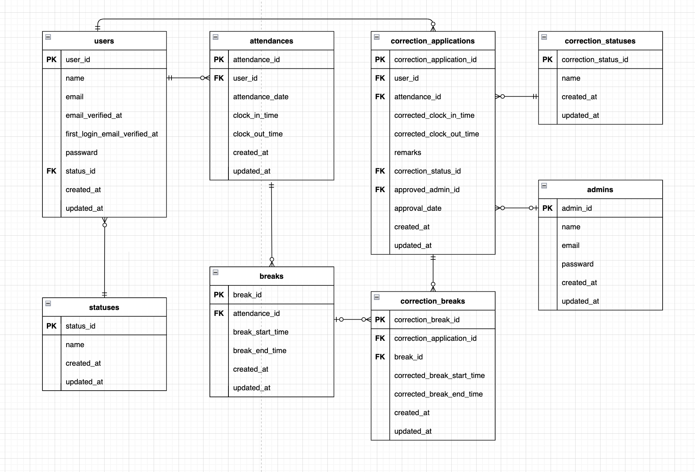

# 勤怠管理アプリ

## 環境構築

### Dockerビルド

```bash
git clone https://github.com/komody/attendance-app
cd attendance-app
docker compose up -d --build
```

### Laravel環境構築

```bash
docker compose exec php bash
cd /var/www
composer install
cp .env.example .env
exit
```

`.env` の環境変数を以下のように設定してください。

```
DB_HOST=mysql
DB_DATABASE=laravel_db
DB_USERNAME=laravel_user
DB_PASSWORD=laravel_pass
MAIL_HOST=mailhog
MAIL_PORT=1025
MAIL_FROM_ADDRESS=noreply@example.com
```

### アプリケーションキーの生成

```bash
docker compose exec php php artisan key:generate
```

### ストレージリンクの作成

```bash
docker compose exec php php artisan storage:link
```

### データベースの作成

```bash
docker compose exec mysql mysql -u root -proot -e "CREATE DATABASE laravel_db;"
```

### データベースマイグレーションの実行

```bash
docker compose exec php php artisan migrate
```

### データベースシーディングの実行

```bash
docker compose exec php php artisan db:seed
```

### フロントエンド依存関係のインストール

```bash
cd src
npm install
```

### フロントエンドのビルド

```bash
npm run dev
```

（`src` ディレクトリで実行）

## テスト実行

### 準備（初回のみ）

```bash
docker compose exec php bash
cd /var/www
cp .env.testing.example .env.testing
exit
```

`.env.testing` の `APP_KEY` を `.env` の `APP_KEY` で上書きしてください。

### 初回のみ: laravel_test を作成

```bash
docker compose exec mysql mysql -u root -proot -e "CREATE DATABASE laravel_test"
```

### テスト実行

```bash
docker compose exec php php artisan test
```

## テストユーザー（ログイン用）

**注意:** 同じ端末とブラウザの場合一般ユーザーか管理者どちらか一方でログインすると、もう一方のアカウントはログアウトされます（同時ログイン不可）。

### 一般ユーザー

| 項目 | 値 |
|------|-----|
| メールアドレス | test@example.com |
| パスワード | password |
| 名前 | テストユーザー |

### 管理者

| 項目 | 値 |
|------|-----|
| メールアドレス | admin@example.com |
| パスワード | password |
| 名前 | 管理者 |

## 使用技術(実行環境)

- PHP 8.1
- Laravel 8.x
- MySQL 8.0.26
- nginx 1.21.1
- Node.js（フロントエンドビルド用・ホスト実行）
- Laravel Mix（Sass）
- Laravel Fortify（認証）

## ER図



## テーブル構造（詳細）

### users（一般ユーザー）

| カラム | 型 | NULL | 説明 |
|--------|------|------|------|
| id | bigint | NO | 主キー |
| name | string(255) | NO | 名前 |
| email | string(255) | NO | メールアドレス（ユニーク） |
| email_verified_at | timestamp | YES | メール認証日時 |
| first_login_email_verified_at | timestamp | YES | 初回ログイン時のメール認証日時 |
| status_id | bigint | YES | 勤務状態ID（外部キー → statuses.id） |
| password | string(255) | NO | パスワード |
| remember_token | string(100) | YES | ログイン維持用トークン |
| created_at | timestamp | YES | 作成日時 |
| updated_at | timestamp | YES | 更新日時 |

### admins（管理者）

| カラム | 型 | NULL | 説明 |
|--------|------|------|------|
| id | bigint | NO | 主キー |
| name | string(255) | NO | 名前 |
| email | string(255) | NO | メールアドレス（ユニーク） |
| password | string(255) | NO | パスワード |
| created_at | timestamp | YES | 作成日時 |
| updated_at | timestamp | YES | 更新日時 |

### statuses（勤務状態マスタ）

| カラム | 型 | NULL | 説明 |
|--------|------|------|------|
| id | bigint | NO | 主キー |
| name | string(255) | NO | 状態名 |
| created_at | timestamp | YES | 作成日時 |
| updated_at | timestamp | YES | 更新日時 |

### correction_statuses（修正申請ステータスマスタ）

| カラム | 型 | NULL | 説明 |
|--------|------|------|------|
| id | bigint | NO | 主キー |
| name | string(255) | NO | ステータス名 |
| created_at | timestamp | YES | 作成日時 |
| updated_at | timestamp | YES | 更新日時 |

### attendances（勤怠）

| カラム | 型 | NULL | 説明 |
|--------|------|------|------|
| id | bigint | NO | 主キー |
| user_id | bigint | NO | ユーザーID（外部キー → users.id） |
| attendance_date | date | NO | 勤務日 |
| clock_in_time | time | NO | 出勤時刻 |
| clock_out_time | time | YES | 退勤時刻 |
| created_at | timestamp | YES | 作成日時 |
| updated_at | timestamp | YES | 更新日時 |

### breaks（休憩）

| カラム | 型 | NULL | 説明 |
|--------|------|------|------|
| id | bigint | NO | 主キー |
| attendance_id | bigint | NO | 勤怠ID（外部キー → attendances.id） |
| break_start_time | time | YES | 休憩開始時刻 |
| break_end_time | time | YES | 休憩終了時刻 |
| created_at | timestamp | YES | 作成日時 |
| updated_at | timestamp | YES | 更新日時 |

### correction_applications（勤怠修正申請）

| カラム | 型 | NULL | 説明 |
|--------|------|------|------|
| id | bigint | NO | 主キー |
| user_id | bigint | NO | ユーザーID（外部キー → users.id） |
| attendance_id | bigint | NO | 勤怠ID（外部キー → attendances.id） |
| corrected_clock_in_time | time | NO | 修正後出勤時刻 |
| corrected_clock_out_time | time | NO | 修正後退勤時刻 |
| remarks | text | NO | 備考 |
| correction_status_id | bigint | NO | 申請ステータスID（外部キー → correction_statuses.id） |
| approved_admin_id | bigint | YES | 承認管理者ID（外部キー → admins.id） |
| approval_date | timestamp | YES | 承認日時 |
| created_at | timestamp | YES | 作成日時 |
| updated_at | timestamp | YES | 更新日時 |

### correction_breaks（修正申請に紐づく休憩）

| カラム | 型 | NULL | 説明 |
|--------|------|------|------|
| id | bigint | NO | 主キー |
| correction_application_id | bigint | NO | 修正申請ID（外部キー → correction_applications.id） |
| break_id | bigint | YES | 休憩ID（外部キー → breaks.id） |
| corrected_break_start | time | NO | 修正後休憩開始 |
| corrected_break_end | time | NO | 修正後休憩終了 |
| created_at | timestamp | YES | 作成日時 |
| updated_at | timestamp | YES | 更新日時 |

## URL

- 開発環境: http://localhost/
- 会員登録: http://localhost/register
- ログイン（一般）: http://localhost/login
- 勤怠画面（要ログイン）: http://localhost/attendance
- 管理者ログイン: http://localhost/admin/login
- phpMyAdmin: http://localhost:8080/
- MailHog（メール確認）: http://localhost:8025/
